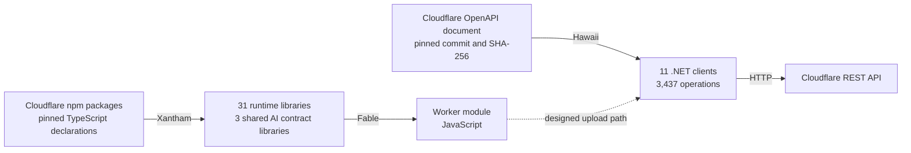

# FSharp.CloudEdge

[](https://developers.cloudflare.com/workers/)
[](https://fable.io)
[](global.json)
[](FSharp.CloudEdge.slnx)
[](https://github.com/fsprojects)
[](LICENSE)

[](https://github.com/shayanhabibi/Xantham)
[](https://github.com/FidelityFramework/Hawaii/tree/fsharp-cloudedge-support)
[](generators/hawaii/pins.json)
[](docs/SDK-LIBRARY.md)

For the purposes of this project, we consider Cloudflare publishing its platform in two different forms: in TypeScript declarations for the code that runs inside a Worker, and in an OpenAPI document for the API that provisions and deploys it. FSharp.CloudEdge is F# generated from both, so a Cloudflare application can be written in one language from its request handlers to its deployment.

On the Worker side, F# code compiles to JavaScript with [Fable](https://fable.io) and imports the npm packages a TypeScript Worker imports, under the names Cloudflare's documentation uses. On the account side, generated .NET clients call Cloudflare's REST API directly. A Worker upload through those clients includes the Worker's bindings in the JSON metadata that Cloudflare documents, so the Worker's configuration can be F# code kept in the same repository as the Worker.

A new Cloudflare release takes a pin change and a regeneration, reviewed against a contract baseline.

## Upstream Foundations

Every generated line in this repository is output from one of two community generators: Xantham, which reads Cloudflare's TypeScript declarations, and Hawaii, which reads Cloudflare's OpenAPI document. The configuration and scripts here pin those inputs by version and hash, and check the generated output before it is installed.



### Xantham

[Xantham](https://github.com/shayanhabibi/Xantham) is the TypeScript-to-F# bindings generator by Shayan Habibi and contributors. It runs the TypeScript 7 compiler as an API server (`tsc --api`) and loads the declaration files Cloudflare publishes in its npm packages through that compiler. The root npm manifest pins the compiler build, `typescript` `7.1.0-dev.20260902.1`. Xantham assigns each generated symbol one of the four grades below and lists every widened or escaped symbol in a manifest beside the generated source.

| Grade | Xantham's definition | Occurrences at acceptance |
| --- | --- | ---: |
| Exact | The F# type accepts and rejects exactly what TypeScript does. | 1,444 |
| Ergonomic | Meaning preserved, spelling made idiomatic. | 3,366 |
| Widened | Information TypeScript had was dropped. | 3,713 |
| Escape | The construct is not represented. | 790 |

The counts come from the September 13, 2026 acceptance audit and include repeated dependencies across targets. For this library, Xantham generated the 31 runtime libraries from 112 selected npm entry points, together with the three AI SDK contract libraries they share. The pinned build is `xantham` `0.1.0-local.8e4c7b11b0ac90236c25`, packed from Xantham commit [`c7e2fa0`](https://github.com/shayanhabibi/Xantham/commit/c7e2fa0daa2ed3ec662cd453ae4c287a6a28673b).

### Hawaii

[Hawaii](https://github.com/Zaid-Ajaj/Hawaii), created by Zaid Ajaj, generates F# clients from OpenAPI documents, with a discriminated union for the possible responses of each endpoint. Its output is a complete project that targets `netstandard2.0`. Onur Gumus maintains a [modernized fork](https://github.com/OnurGumus/Hawaii/tree/modernization), published as [`Hawaii.Unofficial`](https://www.nuget.org/packages/Hawaii.Unofficial). The fork runs on .NET 10 and accepts OpenAPI 2.0 through 3.2 input, and its .NET clients serialize with System.Text.Json.

The [`fsharp-cloudedge-support`](https://github.com/FidelityFramework/Hawaii/tree/fsharp-cloudedge-support) branch adds schema and HTTP-contract corrections to that fork, along with client groups that share one model assembly. Hawaii built from that branch generated this library's control plane from Cloudflare's OpenAPI document:

- 3,437 operations in ten management clients grouped by purpose and one tenancy client
- `FSharp.CloudEdge.Core.Api`, the single assembly that owns every schema and response type the clients use
- a response union for every operation, with one case per declared status

The pinned build is `Hawaii.Unofficial` `1.0.0-local.8b77c5534f22eccbbb0f`.

## Pinned Runtime Surface

The runtime libraries declare the APIs that Worker code calls. Each one is an F# view of an npm package at the version it was generated from. Classes and functions carry `Import` attributes that name the package and the export, with `jsNative` placeholders as bodies. Interfaces describe the shapes of JavaScript values. Fable turns each imported entity into an ES module import of that package. A consuming project lists those npm packages as its own dependencies, and the version column below gives the release each binding describes.

The projects target `net8.0`, so the F# compiler and editors check code against them. The placeholders have no .NET implementation. Fable replaces them with JavaScript imports when it compiles the calling code. `src/Runtime` holds the 31 libraries in eight groups, and `src/Support` holds the AI contract libraries they share plus one handwritten helper. Together the 31 libraries select 112 public entry points from 25 npm packages. Project names in these tables omit the `FSharp.CloudEdge.` prefix.

### Translated Shapes

- TypeScript unions become erased `U2` and `U3` values, as in `ctx.storage.setAlarm(U2.Case1 due)`.
- Promises are `JS.Promise<'T>`. F# code awaits them with `Async.AwaitPromise` and returns them with `Async.StartAsPromise`.
- Package-level functions are static members of an `Exports` type, and subpaths become nested modules: `Gateway.Providers.Unified.Exports.createUnified ()`.
- F# keywords used as member names take double backticks, as in ``` request.``method`` ```.
- A TypeScript type that F# cannot express exactly widens, often to `obj`, and its grade records the loss.

This excerpt from [`tests/SDKComposition/AI.fs`](tests/SDKComposition/AI.fs) routes a Workers AI model through AI Gateway with the shared `LanguageModelV4` contract. The solution build compiles it, and it calls no model.

```fsharp
open Fable.Core

module V4 = FSharp.CloudEdge.Support.AI.V4.Provider
module Gateway = FSharp.CloudEdge.Runtime.AIGatewayProvider
module Workers = FSharp.CloudEdge.Runtime.WorkersAIProvider

let throughGateway (settings: Gateway.AiGatewaySettings) (model: V4.LanguageModelV4) : V4.LanguageModelV4 =
    let gateway = Gateway.Exports.createAiGateway settings
    gateway.chat (U2.Case2 model)

let workersModel (settings: Workers.WorkersAISettings) (modelId: string) : V4.LanguageModelV4 =
    let provider = Workers.Exports.createWorkersAI settings
    provider.chat<string> (U2.Case1 modelId) :> V4.LanguageModelV4

let workersThroughGateway gatewaySettings workersSettings modelId =
    workersModel workersSettings modelId |> throughGateway gatewaySettings
```

### Platform

| Library | npm package | Pinned version | Selected entry points | Covers |
| --- | --- | --- | --- | --- |
| [`Runtime.Workers`](src/Runtime/Platform/FSharp.CloudEdge.Runtime.Workers/) | `@cloudflare/workers-types` | `5.20260906.1` | `.` | The Workers runtime and its native bindings, listed under [native binding surface](#native-binding-surface). `DurableObject`, `WorkerEntrypoint`, `WorkflowEntrypoint` and `RpcTarget` are imported base classes from `cloudflare:workers`. |

### Agents

| Library | npm package | Pinned version | Selected entry points | Covers |
| --- | --- | --- | --- | --- |
| [`Runtime.Agents`](src/Runtime/Agents/FSharp.CloudEdge.Runtime.Agents/) | `agents` | `0.22.0` | `.`, `./agent-tools`, `./chat`, `./chat-sdk`, `./lifecycle`, `./mcp`, `./observability`, `./skills`, `./workflows`, `./experimental/memory/session`, `./experimental/memory/utils` | The Agents SDK core: `Agent`, `routeAgentRequest`, `getAgentByName`, `routeAgentEmail`, `callable`, the MCP server base `McpAgent` with `createMcpHandler`, `AgentWorkflow`, `agentTool`, session memory, `Lifecycle` and `SkillRegistry`. |
| [`Runtime.AgentsAiChatAgent`](src/Runtime/Agents/FSharp.CloudEdge.Runtime.AgentsAiChatAgent/) | `agents` | `0.22.0` | `./ai-chat-agent`, `./ai-chat-v5-migration`, `./ai-types`, `./email`, `./schedule`, `./schedules`, `./types`, `./x402`, `./codemode/ai`, `./mcp/do-oauth-client-provider`, `./mcp/server`, `./observability/ai`, `./schedules/parser`, `./skills/compile` | A second partition of `agents`: email resolvers, `Scheduler` and schedule parsing, the MCP server handler, the Durable Object OAuth client provider for MCP, `wrapAISDK`, `withX402` and `compileSkillScript`. |
| [`Runtime.AgentsMcpClient`](src/Runtime/Agents/FSharp.CloudEdge.Runtime.AgentsMcpClient/) | `agents` | `0.22.0` | `./mcp/client` | The server-side MCP client: `MCPClientManager`, `getNamespacedData`, `normalizeServerId`. |
| [`Runtime.CodeMode`](src/Runtime/Agents/FSharp.CloudEdge.Runtime.CodeMode/) | `@cloudflare/codemode` | `0.5.1` | `.`, `./ai`, `./mcp` | Code Mode, where a model writes code that performs tool calls: `DynamicWorkerExecutor`, `runCode`, `createCodeTool`, `McpConnector`, `OpenApiConnector`, `codeMcpServer`, `openApiMcpServer`. |
| [`Runtime.Shell`](src/Runtime/Agents/FSharp.CloudEdge.Runtime.Shell/) | `@cloudflare/shell` | `0.4.3` | `.` | Sandboxed JavaScript execution and a filesystem for agents, marked experimental upstream: `Workspace`, `InMemoryFs`, `WorkspaceFileSystem` and state backends. |
| [`Runtime.ShellGit`](src/Runtime/Agents/FSharp.CloudEdge.Runtime.ShellGit/) | `@cloudflare/shell` | `0.4.3` | `./git`, `./workers` | Git tools and Workers state connectors: `createGit`, `gitTools`, `StateConnector`, `stateTools`, `stateToolsFromBackend`. |
| [`Runtime.Voice`](src/Runtime/Agents/FSharp.CloudEdge.Runtime.Voice/) | `@cloudflare/voice` | `0.4.0` | `.` | A voice pipeline for agents with speech-to-text, text-to-speech, voice activity detection and SFU sessions: `withVoice`, `withVoiceInput`, `WorkersAITTS`, `WorkersAIFluxSTT`, `WorkersAINova3STT`, `createSFUSession`, `SentenceChunker`. |
| [`Runtime.VoiceErrors`](src/Runtime/Agents/FSharp.CloudEdge.Runtime.VoiceErrors/) | `@cloudflare/voice` | `0.4.0` | `./errors` | Voice error types and helpers: `VoiceProviderError`, `toVoiceError`, `voiceErrorMessage`, `logVoiceError`. |

### AI

| Library | npm package | Pinned version | Selected entry points | Covers |
| --- | --- | --- | --- | --- |
| [`Runtime.AIChat`](src/Runtime/AI/FSharp.CloudEdge.Runtime.AIChat/) | `@cloudflare/ai-chat` | `0.11.0` | `.`, `./ai-chat-v5-migration`, `./types` | Chat agents built on the AI SDK: `AIChatAgent`, `createToolsFromClientSchemas` and message migration helpers. |
| [`Runtime.AIGatewayProvider`](src/Runtime/AI/FSharp.CloudEdge.Runtime.AIGatewayProvider/) | `ai-gateway-provider` | `4.0.0` | `.` and `./providers/` adapters for `amazon-bedrock`, `anthropic`, `azure`, `cerebras`, `cohere`, `deepgram`, `deepseek`, `elevenlabs`, `fireworks`, `google`, `google-vertex`, `groq`, `mistral`, `openai`, `openrouter`, `perplexity`, `unified` and `xai` | AI Gateway as an AI SDK provider: `createAiGateway`, `createUnified` and one factory per provider, such as `createOpenAI`, `createAnthropic` and `createGoogleGenerativeAI`. |
| [`Runtime.WorkersAIProvider`](src/Runtime/AI/FSharp.CloudEdge.Runtime.WorkersAIProvider/) | `workers-ai-provider` | `4.0.0` | `.`, `./anthropic`, `./gateway`, `./google`, `./openai` | Workers AI as an AI SDK provider: `createWorkersAI`, `createAISearch`, `createAutoRAG`, `createGatewayProvider`, plus transcription, speech and reranking models. |
| [`Runtime.AISearchProvider`](src/Runtime/AI/FSharp.CloudEdge.Runtime.AISearchProvider/) | `ai-search-provider` | `0.1.1` | `.` | AI Search as an AI SDK provider: `createAISearchNamespace`, `AISearchChatLanguageModel`. |
| [`Runtime.AIUtils`](src/Runtime/AI/FSharp.CloudEdge.Runtime.AIUtils/) | `@cloudflare/ai-utils` | `1.0.1` | `.` | Tool-calling helpers: `runWithTools`, `createToolsFromOpenAPISpec`, `tool`, `autoTrimTools`. |
| [`Runtime.Think`](src/Runtime/AI/FSharp.CloudEdge.Runtime.Think/) | `@cloudflare/think` | `0.17.0` | `.`, `./extensions`, `./messengers`, `./workflows`, `./tools/execute`, `./tools/extensions`, `./tools/fetch`, `./tools/sandbox`, `./tools/workspace` | A chat agent with an agentic loop, stream resumption, client tools and extensions: `Think`, `ThinkWorkflow`, `ExtensionManager`, `chatSdkMessenger` and tool factories for execute, fetch, sandbox and workspace access. |

AI Gateway and Workers AI share the AI SDK v4 contract. The pinned AI Search provider uses v3, which has its own support library. The two contracts are not interchangeable. The [AI Gateway selection note](docs/AI-GATEWAY-SDK-SELECTION-20260913.md) records the retained provider version and its comparison with the newer patch release.

### Compute

| Library | npm package | Pinned version | Selected entry points | Covers |
| --- | --- | --- | --- | --- |
| [`Runtime.Computer`](src/Runtime/Compute/FSharp.CloudEdge.Runtime.Computer/) | `@cloudflare/computer` | `0.2.1` | `.`, `./git`, `./tools`, `./backends/container`, `./backends/worker-javascript`, `./backends/worker-shell` | A SQLite-backed virtual filesystem that syncs with a container-side daemon: `Workspace`, `getWorkspace`, `withWorkspace`, `SQLiteWorkspaceProvider`, container and Worker backends, `createGitClient`, `createAITools`. |
| [`Runtime.ComputerArtifacts`](src/Runtime/Compute/FSharp.CloudEdge.Runtime.ComputerArtifacts/) | `@cloudflare/computer` | `0.2.1` | `./artifacts`, `./assets`, `./observe/cloudflare`, `./shell/core`, `./shell/curl`, `./shell/file`, `./shell/html-to-markdown`, `./shell/jq`, `./shell/js-exec`, `./shell/python`, `./shell/sqlite`, `./shell/xan`, `./shell/yq` | Artifacts, assets, a Cloudflare observer and shell command modules: `createArtifact`, `runArtifactsCLI`, `createAssets`, `createCloudflareObserver`. |
| [`Runtime.Sandbox`](src/Runtime/Compute/FSharp.CloudEdge.Runtime.Sandbox/) | `@cloudflare/sandbox` | `0.12.9` | `.`, `./opencode` | Sandboxed environments for running commands: `getSandbox`, `Sandbox`, `proxyToSandbox`, `CodeInterpreter`, `streamFile`, `proxyTerminal`, `createOpencode`. |
| [`Runtime.SandboxBridge`](src/Runtime/Compute/FSharp.CloudEdge.Runtime.SandboxBridge/) | `@cloudflare/sandbox` | `0.12.9` | `./bridge`, `./openai` | The sandbox bridge and the `./openai` integration: `bridge`, `WarmPool`, `Shell`, `Editor`. |

### Services

| Library | npm package | Pinned version | Selected entry points | Covers |
| --- | --- | --- | --- | --- |
| [`Runtime.Containers`](src/Runtime/Services/FSharp.CloudEdge.Runtime.Containers/) | `@cloudflare/containers` | `0.3.7` | `.` | Container-enabled Durable Objects: `Container`, `getContainer`, `getRandom`, `loadBalance`, `switchPort`, `ContainerProxy`. It reuses the types that `Runtime.Workers` owns. |
| [`Runtime.Actors`](src/Runtime/Services/FSharp.CloudEdge.Runtime.Actors/) | `@cloudflare/actors` | `0.0.1-beta.6` | `.`, `./alarms`, `./storage` | Actor classes over Durable Objects: `Actor`, `getActor`, `Entrypoint`, `handler`, `Persist`, `Alarms`, `Storage`, and the retry helpers `tryN` and `jitterBackoff`. |
| [`Runtime.Cabidela`](src/Runtime/Services/FSharp.CloudEdge.Runtime.Cabidela/) | `@cloudflare/cabidela` | `0.2.4` | `.` | A JSON Schema validator that runs in Workers without `eval`: `Cabidela`. |
| [`Runtime.DynamicWorkflows`](src/Runtime/Services/FSharp.CloudEdge.Runtime.DynamicWorkflows/) | `@cloudflare/dynamic-workflows` | `0.1.1` | `.` | Routing of Workflow execution to tenant-specific Dynamic Workers: `createDynamicWorkflowEntrypoint`, `dispatchWorkflow`, `wrapWorkflowBinding`. |
| [`Runtime.WorkersOauthProvider`](src/Runtime/Services/FSharp.CloudEdge.Runtime.WorkersOauthProvider/) | `@cloudflare/workers-oauth-provider` | `0.10.3` | `.` | An OAuth provider for Workers: `OAuthProvider`, `getOAuthApi`, `GrantType`, `validateResourceUri`. |
| [`Runtime.KvAssetHandler`](src/Runtime/Services/FSharp.CloudEdge.Runtime.KvAssetHandler/) | `@cloudflare/kv-asset-handler` | `0.5.0` | `.` | Static asset serving from Workers KV: `getAssetFromKV`, `mapRequestToAsset`, `serveSinglePageApp`. |
| [`Runtime.Chanfana`](src/Runtime/Services/FSharp.CloudEdge.Runtime.Chanfana/) | `chanfana` | `3.4.0` | `.` | OpenAPI 3 and 3.1 schema generation and validation for Hono and itty-router: `OpenAPIRoute`, `fromHono`, `fromIttyRouter`, CRUD and D1 endpoint classes, `getSwaggerUI`. |

### RPC

| Library | npm package | Pinned version | Selected entry points | Covers |
| --- | --- | --- | --- | --- |
| [`Runtime.Capnweb`](src/Runtime/RPC/FSharp.CloudEdge.Runtime.Capnweb/) | `capnweb` | `0.12.0` | `.` | RPC with promise pipelining: `RpcTarget`, `RpcStub`, `RpcSession`, `newWorkersRpcResponse`, `newWorkersWebSocketRpcResponse`, `newWebSocketRpcSession`, `newHttpBatchRpcSession`. |

### FeatureFlags

| Library | npm package | Pinned version | Selected entry points | Covers |
| --- | --- | --- | --- | --- |
| [`Runtime.Flagship`](src/Runtime/FeatureFlags/FSharp.CloudEdge.Runtime.Flagship/) | `@cloudflare/flagship` | `0.5.0` | `.`, `./server` | An OpenFeature provider for Flagship feature flags: `FlagshipClient`, `FlagshipServerProvider`, `LoggingHook`, `TelemetryHook`. |

### Pages

| Library | npm package | Pinned version | Selected entry points | Covers |
| --- | --- | --- | --- | --- |
| [`Runtime.PagesPluginCloudflareAccess`](src/Runtime/Pages/FSharp.CloudEdge.Runtime.PagesPluginCloudflareAccess/) | `@cloudflare/pages-plugin-cloudflare-access` | `1.0.5` | `.`, `./api` | Cloudflare Access as a Pages plugin: the plugin itself, `getIdentity`, `generateLoginURL`, `generateLogoutURL`. |
| [`Runtime.PagesPluginTurnstile`](src/Runtime/Pages/FSharp.CloudEdge.Runtime.PagesPluginTurnstile/) | `@cloudflare/pages-plugin-turnstile` | `1.0.2` | `.` | Turnstile verification as a Pages plugin. |
| [`Runtime.PagesPluginStaticForms`](src/Runtime/Pages/FSharp.CloudEdge.Runtime.PagesPluginStaticForms/) | `@cloudflare/pages-plugin-static-forms` | `1.0.3` | `.` | Static form handling as a Pages plugin. |

### Support

| Library | Source | Pinned version | Covers |
| --- | --- | --- | --- |
| [`Support.AI.V4.Provider`](src/Support/AI/FSharp.CloudEdge.Support.AI.V4.Provider/) | `@ai-sdk/provider` | `4.0.10` | The AI SDK v4 model contracts that AI Gateway and Workers AI share: `LanguageModelV4`, `EmbeddingModelV4`, `ImageModelV4`, `SpeechModelV4`, `TranscriptionModelV4`, `RerankingModelV4`, `ProviderV4`. |
| [`Support.AI.V4.OpenAICompatible`](src/Support/AI/FSharp.CloudEdge.Support.AI.V4.OpenAICompatible/) | `@ai-sdk/openai-compatible` | `3.0.44` | OpenAI-compatible chat, embedding and image models: `createOpenAICompatible`. |
| [`Support.AI.V3.Provider`](src/Support/AI/FSharp.CloudEdge.Support.AI.V3.Provider/) | `@ai-sdk/provider` | `3.0.15` | The v3 contracts that AI Search uses: `LanguageModelV3`, `EmbeddingModelV3`, `ProviderV3`. |
| [`Support.Workers`](src/Support/FSharp.CloudEdge.Support.Workers/) | handwritten | n/a | Checked `fetch` access to Durable Object stubs by ID or name: `FetchTransport`, `requireFetchTransport`, `getFetchById`, `getFetchByName`. |

The [selected library guide](docs/SDK-LIBRARY.md) explains the library hierarchy and how libraries share dependency types through catalog imports. Consumer helpers belong in separate F# sources, so the generated files stay reproducible generator output.

### Native Binding Surface

`Runtime.Workers` is one generated file of 25,908 lines from `@cloudflare/workers-types` `5.20260906.1`. Its declarations by area:

| Area | F# declarations |
| --- | --- |
| Handlers and context | `ExportedHandler`, `ExecutionContext`, `FetchEvent`, `ScheduledController`, `ServiceWorkerGlobalScope` |
| `cloudflare:workers` | `DurableObject`, `WorkerEntrypoint`, `WorkflowEntrypoint`, `WorkflowStep`, `RpcTarget`, `RpcStub`, `env`, `exports`, `waitUntil`, `cache`, `tracing` |
| HTTP and fetch | `Request`, `Response`, `Headers`, `FormData`, `Blob`, `URL`, `URLSearchParams`, `URLPattern` |
| Service bindings | `Fetcher`, `Service` |
| Sockets (`cloudflare:sockets`) | `connect`, `Socket`, `SocketOptions`, `SocketAddress` |
| Streams and encoding | `ReadableStream`, `WritableStream`, `TransformStream`, `FixedLengthStream`, `CompressionStream`, `DecompressionStream`, `TextEncoderStream`, `TextDecoderStream` |
| Web Crypto | `SubtleCrypto`, `CryptoKey`, `CryptoKeyPair`, `DigestStream` |
| Cache API | `CacheStorage`, `Cache`, `CacheQueryOptions` |
| HTMLRewriter | `HTMLRewriter`, `Element`, `Comment`, `Text`, `DocumentEnd` |
| WebSockets and hibernation | `WebSocket`, `WebSocketPair`, `acceptWebSocket`, the Durable Object `webSocketMessage` and `webSocketClose` handlers |
| Workers KV | `KVNamespace` with its get, put and list options and results |
| R2 | `R2Bucket`, `R2Object`, `R2ObjectBody`, `R2PutOptions`, `R2HTTPMetadata` |
| D1 | `D1Database` with `withSession`, `D1DatabaseSession`, `D1PreparedStatement`, `D1Result`, `D1ExecResult` |
| Queues | `Queue`, `QueueSendOptions`, `Message`, `MessageBatch` |
| Durable Objects | `DurableObjectNamespace`, `DurableObjectStub`, `DurableObjectId`, `DurableObjectState`, `DurableObjectStorage`, `SqlStorage`, `DurableObjectClass`, `DurableObjectFacets`, `FacetStartupOptions` |
| Containers | `Container`, including outbound HTTP and HTTPS interception and `snapshotContainer`, plus `ContainerStartupOptions` |
| Dynamic Workers | `WorkerLoader`, `WorkerStub`, `WorkerLoaderWorkerCode` |
| Workers for Platforms | `DispatchNamespace`, `DynamicDispatchOptions` |
| Workflows (`cloudflare:workflows`) | `Workflow`, `WorkflowInstance`, `WorkflowStepConfig`, `WorkflowEvent`, `NonRetryableError` |
| Workers AI | `Ai` with `run`, `gateway`, `aiSearch`, `autorag`, `models` and `toMarkdown`. `AiModels` lists 98 models with their input and output types. |
| AI Gateway, AI Search, AutoRAG | `AiGateway`, `AiSearchNamespace`, `AiSearchInstance`, `AutoRAG` |
| Vectorize | `Vectorize`, `VectorizeIndex`, `VectorizeVector`, `VectorizeMatch`, `VectorizeMatches`, `VectorizeQueryOptions` |
| Hyperdrive | `Hyperdrive` with `connectionString` |
| Analytics Engine | `AnalyticsEngineDataset` with `writeDataPoint`, `AnalyticsEngineDataPoint` |
| Images, media and Stream | `ImagesBinding`, `ImageTransformer`, `MediaTransformer`, `MediaTransformationGenerator`, `StreamBinding` |
| Markdown conversion | `ToMarkdownService` |
| Email (`cloudflare:email`) | `EmailMessage`, `ForwardableEmailMessage`, `SendEmail`, `EmailEvent` |
| Pipelines (`cloudflare:pipelines`) | `Pipeline`, `PipelineRecord`, `PipelineTransformationEntrypoint` |
| Tail and trace | `TailEvent`, `TraceItem`, `TraceLog`, `TraceMetrics`, `TraceDiagnosticChannelEvent` |
| Other bindings | `RateLimit`, `SecretsStoreSecret`, `WorkerVersionMetadata`, `AgentMemoryProfile`, `Artifacts`, `Flagship`, Browser Run options |
| Node compatibility (`cloudflare:node`) | `httpServerHandler` |

The table lists generated declarations. Behavior against a live binding is a separate check, covered under [bounded evidence](#bounded-evidence).

### Deferred Inventory

The selection covers server-side resource APIs, including AI Gateway for Workers AI and for external model access. The broader pinned inventory holds 1,106 public inputs in 81 compiler programs, and [`config/sdk-delivery.json`](config/sdk-delivery.json) records a reason for each of the 50 partitions left out:

| Reason | Partitions left out |
| --- | --- |
| Browser, UI, mobile and client adapters sit outside the server-side delivery | 20, including the React adapters for agents and chat, the RealtimeKit UI and mobile packages, the Stream Angular and React components and the sandbox terminal adapter |
| Development tooling sits outside the runtime delivery | 2: the Code Mode Vite integration and the Worker bundler |
| Optional integrations stay available for community demand | 19, including Hono agents, seven further Pages plugins, TanStack AI and voice provider adapters |
| Browser automation waits for a concrete application requirement | 4: Playwright, Playwright MCP, Puppeteer and the Think browser tools |
| Alternate preview surfaces stay opt-in | 4: the Sandbox preview packages and the experimental Workers types |
| AI Gateway delivery uses `ai-gateway-provider` | 1: a shelved alternate package |

`npm run build:sdk -- --all --plan` lists the broad inventory, and `--all` attempts it without defining acceptance. That inventory is open to community contributions driven by concrete demand.

## Code-First Control Plane

The control plane here is Cloudflare's REST API, generated as F# clients. Creating a D1 database and uploading a Worker are method calls in the same program that holds the Worker's configuration. Ten clients in `src/Management` are grouped by purpose, and `src/Tenancy` holds the account-level client. All eleven client projects reference `src/Core`, the single model assembly that owns every schema and response type. The twelve projects target `netstandard2.0` and depend on `FSharp.SystemTextJson`, so any .NET process can host them, from a build script to a CI job.

- Each client takes an `HttpClient` whose `BaseAddress` is Cloudflare's API root, `https://api.cloudflare.com/client/v4`. The caller sets authentication, such as a bearer [API token](https://developers.cloudflare.com/fundamentals/api/get-started/create-token/).
- Every operation returns a `Task` of a response union with one case per declared status. An undeclared status raises an exception.
- Request bodies are F# records with a `Create` factory for their required fields. About half of the response `result` fields are `System.Text.Json` nodes, and the rest have generated types.
- Optional parameters are F# optional arguments, and some parameters are F# lists. C# callers see them as `FSharpOption<T>` and `FSharpList<T>` parameters. The repository exercises the clients from F# consumers.

The shape of a call, written against the generated `TenancyClient`:

```fsharp
open System
open System.Net.Http
open System.Net.Http.Headers
open FSharp.CloudEdge.Core.Api.Types
open FSharp.CloudEdge.Tenancy

let listAccounts (apiToken: string) =
    task {
        use http = new HttpClient(BaseAddress = Uri "https://api.cloudflare.com/client/v4")
        http.DefaultRequestHeaders.Authorization <- AuthenticationHeaderValue("Bearer", apiToken)
        let tenancy = TenancyClient http
        match! tenancy.AccountsListAccounts() with
        | AccountsListAccounts.OK page ->
            for account in Option.defaultValue [] page.result do
                printfn "%s" account.name
        | AccountsListAccounts.Status4XX(status, _) ->
            eprintfn "Cloudflare returned HTTP %d" status
    }
```

[`tests/HawaiiApi/Program.fs`](tests/HawaiiApi/Program.fs) exercises the same clients against a loopback server, including a multipart asset upload and the rejection of an undeclared status.

### Deploy-Path Operations

`WorkerScriptUploadWorkerModule` takes a Worker's modules as `files` and its configuration as `metadata`, a `System.Text.Json.Nodes.JsonObject`. Cloudflare [documents that metadata](https://developers.cloudflare.com/workers/configuration/multipart-upload-metadata/) as the Worker's configuration in JSON. The operations around the upload are generated too:

| Step | Generated method |
| --- | --- |
| Upload a Worker module with its metadata | `ComputeClient.WorkerScriptUploadWorkerModule` |
| Upload a version, then deploy it | `ComputeClient.WorkerVersionsUploadVersion`, `ComputeClient.WorkerDeploymentsCreateDeployment` |
| Upload static assets | `ComputeClient.WorkerScriptUpdateCreateAssetsUploadSession`, `ComputeClient.WorkerAssetsUpload` |
| Set secrets and cron triggers | `ComputeClient.WorkerPutScriptSecret`, `ComputeClient.WorkerCronTriggerUpdateCronTriggers` |
| Route traffic to the Worker | `ComputeClient.WorkerRoutesCreateRoute`, `ComputeClient.WorkersDomainsUpdate`, `ComputeClient.WorkerScriptPostSubdomain` |
| Start a log tail | `ComputeClient.WorkerTailLogsStartTail` |
| Upload into a Workers for Platforms dispatch namespace | `ComputeClient.NamespaceWorkerScriptUploadWorkerModule` |
| Deploy a Pages project | `ComputeClient.PagesDeploymentCreateDeployment` |
| Create a queue | `ComputeClient.QueuesCreate` |
| Create D1, R2, KV, Vectorize and Hyperdrive resources | `StorageClient.D1CreateDatabase`, `StorageClient.R2CreateBucket`, `StorageClient.WorkersKvNamespaceCreateANamespace`, `StorageClient.VectorizeCreateVectorizeIndex`, `StorageClient.CreateHyperdrive` |
| Create an AI Gateway | `AIClient.AigConfigCreateGateway` |

The deploy path is designed around these clients: existing JavaScript build tools bundle the Fable output, and a host-side program provisions resources and uploads the module with its bindings and migrations.

### Purpose-Grouped Clients

| Project | Client | Operations | Covers |
| --- | --- | ---: | --- |
| [`Management.Compute`](src/Management/FSharp.CloudEdge.Management.Compute/) | `ComputeClient` | 304 | Workers scripts, versions, deployments and settings, Workers for Platforms, Pages, Workers Builds, Queues, Workflows, Pipelines, Containers, Browser Rendering, Flagship, Snippets |
| [`Management.Storage`](src/Management/FSharp.CloudEdge.Management.Storage/) | `StorageClient` | 153 | R2 and R2 Data Catalog, Workers KV, D1, Hyperdrive, Vectorize, Secrets Store, Artifacts, Resource Library |
| [`Management.AI`](src/Management/FSharp.CloudEdge.Management.AI/) | `AIClient` | 152 | AI Gateway, Workers AI models, finetunes and runs, AI Search, AutoRAG, Agent Memory, AI Audit |
| [`Management.Media`](src/Management/FSharp.CloudEdge.Management.Media/) | `MediaClient` | 175 | Stream, Images, Realtime and RealtimeKit, Calls TURN and SFU apps, Media over QUIC relays |
| [`Management.Messaging`](src/Management/FSharp.CloudEdge.Management.Messaging/) | `MessagingClient` | 98 | Email Routing and the Email service, notification policies, event subscriptions, R2 event notifications |
| [`Management.Networking`](src/Management/FSharp.CloudEdge.Management.Networking/) | `NetworkingClient` | 505 | DNS, Cloudflare Tunnel and WARP Connector, Magic networking, load balancing, Waiting Room, Spectrum, IP addressing, custom pages |
| [`Management.Security`](src/Management/FSharp.CloudEdge.Management.Security/) | `SecurityClient` | 1,295 | Zero Trust (Access, Gateway, devices, DLP, DEX), WAF, rulesets and firewall rules, API Shield, certificates and SSL, Security Center, Cloudforce One, email security, scanners |
| [`Management.Observability`](src/Management/FSharp.CloudEdge.Management.Observability/) | `ObservabilityClient` | 386 | Logs and Logpush, audit logs, analytics including Analytics Engine SQL, RUM, Radar, diagnostics |
| [`Management.ContentDelivery`](src/Management/FSharp.CloudEdge.Management.ContentDelivery/) | `ContentDeliveryClient` | 65 | Cache settings, Page Rules, Pay per crawl, Smart Shield, URL normalization, environments |
| [`Management.Browser`](src/Management/FSharp.CloudEdge.Management.Browser/) | `BrowserClient` | 4 | Account-level browser extension settings. Browser Rendering is in `ComputeClient`. |
| [`Tenancy`](src/Tenancy/FSharp.CloudEdge.Tenancy/) | `TenancyClient` | 300 | Accounts, organizations, tenants, members and roles, IAM groups, API tokens, zones, registrar, billing and subscriptions, user settings |
| [`Core.Api`](src/Core/FSharp.CloudEdge.Core.Api/) | none | 0 | Every schema and response type, plus the shared HTTP layer and serializer |

### Service Family Map

The taxonomy in [`generators/hawaii/taxonomy.json`](generators/hawaii/taxonomy.json) assigns each of the 3,448 source operations to one of 164 family owners, with none unclassified. `api-health` owns only an excluded health route, so 163 families carry selected operations:

| Client | Families, with selected operations |
| --- | --- |
| `ComputeClient` | workers 114 · builds 31 · browser-rendering 28 · pages 26 · queues 23 · workflows 23 · pipelines 19 · containers 14 · flagship 14 · snippets 8 · triggers 4 |
| `StorageClient` | r2 46 · vectorize 24 · artifacts 17 · storage (Workers KV) 14 · r2-catalog 13 · d1 12 · secrets-store 12 · hyperdrive 8 · resource-library 7 |
| `AIClient` | ai-gateway 66 · ai-search 49 · agent-memory 14 · ai 14 · autorag 7 · ai-audit 2 |
| `MediaClient` | realtime 61 · stream 50 · images 44 · calls 10 · moq 8 · media 2 |
| `MessagingClient` | email 64 · alerting 25 · event-subscriptions 5 · event-notifications 4 |
| `NetworkingClient` | magic 177 · load-balancers 42 · addressing 41 · secondary-dns 28 · waiting-rooms 24 · custom-pages 18 · cni 16 · mnm 16 · dns-records 15 · teamnet 14 · cfd-tunnel 12 · web3 12 · warp-connector 11 · dns-firewall 9 · dns-settings 9 · healthchecks 9 · spectrum 9 · data-localization 7 · origin 7 · connectivity 5 · custom-ns 5 · argo 4 · dnssec 4 · hostnames 4 · cloud-connector 2 · dns-analytics 2 · cache 1 · ips 1 · tunnels 1 |
| `SecurityClient` | cloudforce-one 231 · access 165 · dlp 93 · email-security 73 · devices 70 · gateway 57 · api-gateway 44 · firewall 42 · brand-protection 41 · intel 39 · data-security 36 · rulesets 32 · dex 31 · security-center 26 · vuln-scanner 22 · scim 16 · schema-validation 15 · token-validation 15 · zerotrust 15 · urlscanner 14 · origin-tls-client-auth 13 · page-shield 13 · ssl 12 · custom-hostnames 11 · one 11 · rules 11 · zt-risk-scoring 11 · abuse-reports 10 · pcaps 9 · content-upload-scan 8 · custom-csrs 8 · infrastructure 8 · filters 7 · leaked-credential-checks 7 · oauth-clients 7 · advanced-certificates 6 · challenges 6 · custom-certificates 6 · sso-connectors 6 · client-certificates 5 · keyless-certificates 5 · mtls-certificates 5 · rate-limits 5 · ai-security 4 · bot-management 4 · botnet-feed 4 · certificates 4 · managed-headers 3 · certificate-authorities 2 · ct 2 · fraud-detection 2 · precursor 2 · dcv-delegation 1 |
| `ObservabilityClient` | radar 273 · logpush 34 · logs 29 · rum 13 · analytics 10 · speed-api 10 · diagnostics 6 · reporting 6 · analytics-engine 2 · audit-logs 1 · rate-limit-analytics 1 · request-tracer 1 |
| `ContentDeliveryClient` | cache 21 · pay-per-crawl 17 · smart-shield 10 · environments 7 · pagerules 7 · url-normalization 3 |
| `BrowserClient` | browser-extension 4 |
| `TenancyClient` | settings 57 · user 55 · shares 20 · billing 18 · organizations 18 · iam 17 · zones 16 · registrar 13 · subscriptions 13 · registrar-sandbox 10 · tags 10 · tenants 8 · tokens 8 · accounts 7 · payment-methods 6 · members 5 · memberships 4 · subscription 4 · entitlements 2 · profile 2 · roles 2 · invoices 1 · oauth 1 · pay-bad-debt 1 · pay-invoice 1 · receipts 1 |

## Traceable Generation

Regeneration never patches generated F# text. Each input that shapes the output is pinned, and each decision about what enters the build has a written record:

| Practice | Record |
| --- | --- |
| Cloudflare's OpenAPI document is pinned to commit `f2df0ca` of `cloudflare/api-schemas` and to its SHA-256. | [`generators/hawaii/pins.json`](generators/hawaii/pins.json) |
| Xantham, Hawaii and Fable are pinned to exact versions with roll-forward disabled. The generator packages are checked by package and payload hash before and after each run. | [`.config/dotnet-tools.json`](.config/dotnet-tools.json), [`config/tool-packages.json`](config/tool-packages.json) |
| The root npm manifest pins the TypeScript compiler, and each SDK has its own locked dependency profile, 55 in all. | [`package.json`](package.json), [`config/targets.json`](config/targets.json), [`profiles/`](profiles/) |
| Xantham output carries a do-not-edit header. Hawaii output stays byte-identical to the generator's output, and an ownership receipt records its file hashes so that later runs refuse to overwrite edited or unowned files. | [`generators/hawaii/README.md`](generators/hawaii/README.md), [`inventory/hawaii-output-ownership.json`](inventory/hawaii-output-ownership.json) |
| Every SDK import is selected by name, and each omitted import or deferred partition carries a reason. A newly inventoried import cannot enter the delivery silently. | [`config/sdk-delivery.json`](config/sdk-delivery.json), [`docs/SDK-DELIVERY-SCOPE.md`](docs/SDK-DELIVERY-SCOPE.md) |
| Each of the 3,448 source operations has a recorded disposition: 3,437 included, 8 excluded as retired and 3 excluded as internal. Every exclusion names a reason and primary sources, and deprecation alone never removes an operation. | [`operation-selection-coverage.json`](generators/hawaii/inventory/operation-selection-coverage.json), [`operation-policy.json`](generators/hawaii/lifecycle/operation-policy.json) |
| Hawaii rejects unsupported named unions, except for 217 listed schemas whose payload stays in a named JSON wrapper. | [`generators/hawaii/preserve-json-schemas.json`](generators/hawaii/preserve-json-schemas.json) |
| A contract baseline records 7,794 owned declarations and fingerprints 3,437 operations. `npm run test:contracts` recomputes it, and an upgrade is reviewed as a difference against it. | [`tests/integration/baselines/`](tests/integration/baselines/) |

The acceptance bar is consumers that compile against shared contracts, with each remaining loss reported. A widening is repaired when it stops a selected consumer from passing a resource or model directly between libraries. The [grade table](#xantham) gives the counts at acceptance.

Reviewed source corrections belong to the input pipelines, which keep the original and transformed hashes. An unexpected output is a failure, and so is a stale pin or a failed generator process.

- [`config/declaration-overlays.json`](config/declaration-overlays.json) holds reviewed repairs to published TypeScript declaration files. The pinned RealtimeKit callstats package, for example, contains an unresolved internal import alias, and its other shipped declarations identify the intended relative import. The runner verifies the package and source hashes, applies the correction to a cached copy of the input and records the rule in the generation receipt. `npm ci` stays reproducible, and a changed upstream file requires a fresh review of the rule. These repairs belong to this repository. General type and rendering fixes belong in Xantham.
- [`generators/hawaii/pins.json`](generators/hawaii/pins.json) lists four OpenAPI source overlays, each justified from primary sources:
  - upload security schemes
  - uppercase Spectrum status classes
  - explicit query encodings
  - Tunnel failure responses, which correct 47 Tunnel error contracts

[`config/sdk-surfaces.json`](config/sdk-surfaces.json) keeps the broad inventory, and [`config/targets.json`](config/targets.json) keeps its canonical targets and pinned profiles. [`config/sdk-delivery.json`](config/sdk-delivery.json) selects the delivered public inputs and records deferrals. It also supplies support owners and catalog imports. The [Hawaii pipeline](generators/hawaii/README.md) records operation ownership and lifecycle disposition independently of upstream tags. The [SDK inventory](inventory/cloudflare-sdk-inventory-20260906.json) keeps the primary-source discovery snapshot, and its probe notes describe that snapshot's checks.

A local build writes reproducible reports under `artifacts/`, which is not committed:

- per-symbol grade findings and the effective configuration
- generation receipts with compiler, generator and source hashes
- dependency audits and build results

Successful compilation does not by itself establish complete SDK coverage.

## Bounded Evidence

The [September 13 acceptance record](docs/SDK-DELIVERY-ACCEPTANCE-20260913.md) documents the accepted delivery and its non-blocking limitations. Its evidence comes from local runs:

- The pinned tools generated the 34 SDK and support libraries, and the 50-project solution built in Release.
- [`tests/SDKComposition`](tests/SDKComposition/README.md) holds cross-library consumers that compile in that build. A Workers `Request` passes through Containers' `switchPort` without casts, and Workers AI models reach AI Gateway through `LanguageModelV4`. A direct F# Durable Object subclass uses storage transactions and alarms.
- [`tests/HawaiiApi`](tests/HawaiiApi/README.md) exercises the generated Tenancy and Compute clients against a loopback server. It covers account listing and a multipart asset upload, plus a 429 status class and the rejection of an undeclared 599.
- [`tests/ByteBridge`](tests/ByteBridge/README.md) exercises Fable-compiled Workers body bindings with BAREWire's binary codecs under Node Fetch. All 13 checks passed with Fable 5.13.0, Node 25.1.0 and BAREWire commit `5af58d8`.
- The [Durable Object acceptance](docs/DURABLE-OBJECTS-ACCEPTANCE.md) run, a local workerd lifecycle from a separate validation checkout, passed seven assertion groups with verified cleanup. The Agents run passed with its JavaScript subclass adapter in place.

The boundaries of that evidence:

- These checks created no Cloudflare resources. The [integration acceptance architecture](docs/INTEGRATION-ACCEPTANCE.md) specifies hosted test families that carry real resources from deployment through cleanup and then confirm their absence. The families are designed to run through the generated management clients, and they report incomplete until their deployment adapters exist.
- Generic Durable Object RPC stubs widen to `obj`. `Support.Workers` adds checked `fetch` access by ID or name, and arbitrary RPC methods stay outside its contract.
- The ambient `DurableObject` base is directly subclassable from F#. An ordinary `Container` is not.
- Hosted behavior such as eviction and hibernation has its own acceptance, separate from these local checks.
- Client-side adapters and optional integrations sit outside the selection, as listed under [deferred inventory](#deferred-inventory).

The [first delivery handoff](docs/FIRST-DELIVERY-HANDOFF-20260913.md) keeps the preceding validation history, and the [completeness scope](docs/CLOUDFLARE-COMPLETENESS-SCOPE-20260913.md) keeps the discovery evidence for the broad inventory.

## Local Tool Bootstrap

FSharp.CloudEdge is consumed from source, and no FSharp.CloudEdge package is on NuGet. The runtime projects reference local builds of Xantham's support packages, and both generators run as pinned local .NET tools, so a first setup packs them from generator checkouts.

You need:

- the .NET SDK `10.0.401` or a later `10.0.4xx` patch, as [`global.json`](global.json) requires
- Node.js with npm (the recorded runs used Node 25.1.0)
- Python 3 for the Hawaii runner, and `jsonschema` 4.26.0 for its tooling tests
- Xantham at commit [`c7e2fa0`](https://github.com/shayanhabibi/Xantham/commit/c7e2fa0daa2ed3ec662cd453ae4c287a6a28673b) and Hawaii on its [`fsharp-cloudedge-support`](https://github.com/FidelityFramework/Hawaii/tree/fsharp-cloudedge-support) branch, checked out beside this repository
- a BAREWire checkout for the ByteBridge consumer, which the solution includes

The default layout:

```text
repos/
  FSharp.CloudEdge/
  Xantham/
  Hawaii/
  BAREWire/
```

```sh
npm ci
npm run tools:bootstrap
npm run tools:restore
npm run install:profiles -- --delivery
npm run test:support-package
npm run build
npm run test:bridge
```

| Command | What it does |
| --- | --- |
| `npm run tools:bootstrap` | Packs Xantham and Hawaii in Release from the sibling checkouts, writes the packages to the ignored `artifacts/tool-feed/`, and installs them in the local tool manifest. `--xantham-source` and `--hawaii-source` take other locations, and `--only xantham` or `--only hawaii` rebuilds one tool. |
| `npm run tools:restore` | Restores the manifest's tool versions with `dotnet tool restore`. It needs the local packages until those versions are on a package feed. |
| `npm run install:profiles -- --delivery` | Installs the 24 dependency profiles the delivery selects, with its generated support owners and profile overrides. Profile IDs select others (`-- agents sandbox`) but cannot be combined with `--delivery`. Without arguments the installer keeps its broad-inventory behavior. |
| `npm run test:support-package` | Checks package-only compilation of the Xantham support package and its Fable operations. |
| `npm run build` | Generates and compiles the selected hierarchy through both tools. `-- --plan` reviews the selection, and `-- --resume` reuses authenticated output while compiling. |
| `npm run build:sdk` | Runs only the SDK portion and accepts library IDs (`-- workers containers`). `-- --all --plan` lists the broad inventory, and `-- --all` attempts it, deferred integrations included. |
| `npm run build:bindings` | Authenticates and builds the selected SDK hierarchy. |
| `npm run test:bridge` | Builds the ByteBridge consumer, compiles it with Fable and runs its checks under Node. |
| `npm run test:tooling` | Runs the selection, ownership and orchestration tests. |
| `npm run test:contracts` | Recomputes the contract baseline and refuses stale evidence. |
| `npm test` | Runs the tooling, integration-tooling, contract and Hawaii tooling tests, then `build -- --resume` and `test:bridge`. |

Routine generation invokes the pinned packaged tools and never builds or reads the generator checkouts. Before it accepts project references, the build authenticates catalog input and generated source hashes along with owner graphs and profile fingerprints. Set `CLOUDEDGE_DOTNET` to use another dotnet executable. The older `generate` and `plan:sdk` scripts operate on the broad canonical inventory, and so do direct `projects.mjs` calls. Use `build` or `build:sdk` consistently for the delivery configuration.

Each folder under `profiles/` pins one SDK and its compatible declaration providers, and lockfiles preserve nested dependency versions. The profiles stay separate because current SDK releases can require conflicting versions of shared dependencies such as the AI SDK and React. The F# projects pin Fable.Core 5.2.0 and, as exact package references, the generated compiler-library bindings `Xantham.Fable.Core` and `Xantham.Fable.Core.TS` that Xantham's compile gate uses. Bootstrap packages their source with the Fable source assets consumers need, and [upstream issues](docs/upstream-issues.md) records the helper-function correction and its retained runtime regression.

A local rebuild of either generator can change package bytes and produce a new local version. Review the tool manifest and package lock alongside the generated-source changes, then rerun validation before treating the new output as equivalent. The [local tools walkthrough](docs/local-tools.md) covers first setup and version changes, including the later move to published packages. The [SDK build guide](docs/sdk-build.md) explains saved configurations and evidence, and the [Hawaii pipeline](generators/hawaii/README.md) documents management generation.

`FSharp.CloudEdge.slnx` holds the generated hierarchy and the consumer projects. `FSharp.CloudEdge.Bindings.slnx` holds the generated projects and the handwritten Workers support project. `SDK.Partitions.slnx` and `Hawaii.Bindings.slnx` expose the two generator pipelines separately.

## Community Maintenance

FSharp.CloudEdge is an fsprojects repository, meant for community maintenance. Generator fixes go upstream, and Cloudflare-specific decisions stay here:

| Belongs upstream in Xantham or Hawaii | Belongs here |
| --- | --- |
| Type mapping, rendering and client generation fixes | Package and operation selection, dependency profiles and pins, service taxonomy, lifecycle policy, library organization and consumer tests |

Changes to input pins or generator packages should include the regenerated output and the corresponding validation results. A successful build alone does not establish complete service coverage. The local setup and acceptance commands are designed so that another contributor can reproduce those checks without the original development machine.

FSharp.CloudEdge is released under the MIT license in [LICENSE](LICENSE). The npm packages the bindings import carry their own licenses, so check each package's terms. Cloudflare and Cloudflare Workers are trademarks and/or registered trademarks of Cloudflare, Inc. in the United States and other jurisdictions.
