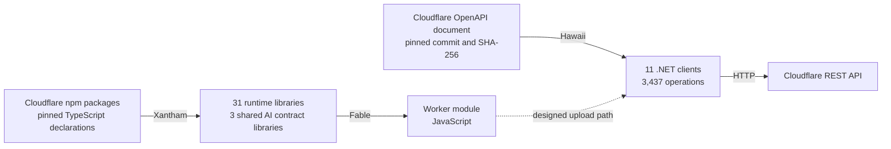

# FSharp.CloudEdge

[](https://developers.cloudflare.com/workers/)
[](https://fable.io)
[](global.json)
[](FSharp.CloudEdge.slnx)

[](LICENSE)

[](https://github.com/shayanhabibi/Xantham)
[](https://github.com/FidelityFramework/Hawaii/tree/fsharp-cloudedge-support)

For the purposes of this project, we consider Cloudflare publishing its platform in two different forms: in TypeScript declarations for the code that runs inside a Worker, and in an OpenAPI document for the API that provisions and deploys it. FSharp.CloudEdge is F# generated from both, so a Cloudflare application can be written in one language from its request handlers to its deployment.

On the Worker side, F# code compiles to JavaScript with [Fable](https://fable.io) and imports the npm packages a TypeScript Worker imports, under the names Cloudflare's documentation uses. On the account side, generated .NET clients call Cloudflare's REST API directly. A Worker upload through those clients includes the Worker's bindings in the JSON metadata that Cloudflare documents, so the Worker's configuration can be F# code kept in the same repository as the Worker.

A new Cloudflare release takes a pin change and a regeneration, reviewed against a contract baseline.

## Upstream Foundations

Every generated line in this repository is output from one of two community generators: Xantham, which reads Cloudflare's TypeScript declarations, and Hawaii, which reads Cloudflare's OpenAPI document. The configuration and scripts here pin those inputs by version and hash, and check the generated output before it is installed.



### Xantham

[Xantham](https://github.com/shayanhabibi/Xantham) is the TypeScript-to-F# bindings generator by Shayan Habibi and contributors. It runs the TypeScript 7 compiler as an API server (`tsc --api`) and loads the declaration files Cloudflare publishes in its npm packages through that compiler. The root npm manifest pins the compiler build, `typescript` `7.1.0-dev.20260902.1`. Xantham assigns each generated symbol one of the four grades below and lists every widened or escaped symbol in a manifest beside the generated source.

| Grade | Xantham's definition | Occurrences at acceptance |
| --- | --- | ---: |
| Exact | The F# type accepts and rejects exactly what TypeScript does. | 1,444 |
| Ergonomic | Meaning preserved, spelling made idiomatic. | 3,366 |
| Widened | Information TypeScript had was dropped. | 3,713 |
| Escape | The construct is not represented. | 790 |

The counts come from the September 13, 2026 acceptance audit and include repeated dependencies across targets. For this library, Xantham generated the 31 runtime libraries from 112 selected npm entry points, together with the three AI SDK contract libraries they share. The pinned build is `xantham` `0.1.0-local.8e4c7b11b0ac90236c25`, packed from Xantham commit [`c7e2fa0`](https://github.com/shayanhabibi/Xantham/commit/c7e2fa0daa2ed3ec662cd453ae4c287a6a28673b).

### Hawaii

[Hawaii](https://github.com/Zaid-Ajaj/Hawaii), created by Zaid Ajaj, generates F# clients from OpenAPI documents, with a discriminated union for the possible responses of each endpoint. Its output is a complete project that targets `netstandard2.0`. Onur Gumus maintains a [modernized fork](https://github.com/OnurGumus/Hawaii/tree/modernization), published as [`Hawaii.Unofficial`](https://www.nuget.org/packages/Hawaii.Unofficial). The fork runs on .NET 10 and accepts OpenAPI 2.0 through 3.2 input, and its .NET clients serialize with System.Text.Json.

The [`fsharp-cloudedge-support`](https://github.com/FidelityFramework/Hawaii/tree/fsharp-cloudedge-support) branch adds schema and HTTP-contract corrections to that fork, along with client groups that share one model assembly. Hawaii built from that branch generated this library's control plane from Cloudflare's OpenAPI document:

- 3,437 operations in ten management clients grouped by purpose and one tenancy client
- `FSharp.CloudEdge.Core.Api`, the single assembly that owns every schema and response type the clients use
- a response union for every operation, with one case per declared status

The pinned build is `Hawaii.Unofficial` `1.0.0-local.8b77c5534f22eccbbb0f`.

## Library Line-Up

The 31 runtime libraries bind the Cloudflare SDKs below, and 11 control-plane clients call Cloudflare's REST API. Project names start with `FSharp.CloudEdge.`, and [`docs/SDK-DELIVERY-SCOPE.md`](docs/SDK-DELIVERY-SCOPE.md) lists each project with its npm package and pinned version.

| Area | Cloudflare SDKs |
| --- | --- |
| Workers platform | Workers runtime types and native bindings |
| Agents | Agents SDK, Code Mode, Shell, Voice |
| AI | AI Chat, Think, AI Utils, and the AI Gateway, Workers AI and AI Search providers |
| Compute | Computer, Sandbox |
| Services | Containers, Actors, Dynamic Workflows, Workers OAuth Provider, KV Asset Handler, Cabidela, Chanfana |
| RPC | Cap'n Web |
| Feature flags | Flagship |
| Pages | Cloudflare Access, Turnstile and Static Forms plugins |
| Control plane | Ten management clients grouped by purpose and one tenancy client, 3,437 REST operations over shared `Core.Api` types |

Client-side adapters and optional integrations are left out of this selection, and [`config/sdk-delivery.json`](config/sdk-delivery.json) records the reason for each.

## Paired Examples

This Worker-side excerpt from [`tests/SDKComposition/AI.fs`](tests/SDKComposition/AI.fs) passes a Workers AI model to AI Gateway through the shared `LanguageModelV4` contract. The solution build compiles it, and it makes no model call.

```fsharp
open Fable.Core

module V4 = FSharp.CloudEdge.Support.AI.V4.Provider
module Gateway = FSharp.CloudEdge.Runtime.AIGatewayProvider
module Workers = FSharp.CloudEdge.Runtime.WorkersAIProvider

let throughGateway (settings: Gateway.AiGatewaySettings) (model: V4.LanguageModelV4) : V4.LanguageModelV4 =
    let gateway = Gateway.Exports.createAiGateway settings
    gateway.chat (U2.Case2 model)

let workersModel (settings: Workers.WorkersAISettings) (modelId: string) : V4.LanguageModelV4 =
    let provider = Workers.Exports.createWorkersAI settings
    provider.chat<string> (U2.Case1 modelId) :> V4.LanguageModelV4

let workersThroughGateway gatewaySettings workersSettings modelId =
    workersModel workersSettings modelId |> throughGateway gatewaySettings
```

On the control-plane side, this function lists the accounts visible to an API token through the generated `TenancyClient`:

```fsharp
open System
open System.Net.Http
open System.Net.Http.Headers
open FSharp.CloudEdge.Core.Api.Types
open FSharp.CloudEdge.Tenancy

let listAccounts (apiToken: string) =
    task {
        use http = new HttpClient(BaseAddress = Uri "https://api.cloudflare.com/client/v4")
        http.DefaultRequestHeaders.Authorization <- AuthenticationHeaderValue("Bearer", apiToken)
        let tenancy = TenancyClient http
        match! tenancy.AccountsListAccounts() with
        | AccountsListAccounts.OK page ->
            for account in Option.defaultValue [] page.result do
                printfn "%s" account.name
        | AccountsListAccounts.Status4XX(status, _) ->
            eprintfn "Cloudflare returned HTTP %d" status
    }
```

[`tests/HawaiiApi/Program.fs`](tests/HawaiiApi/Program.fs) exercises the same clients against a loopback server, including a multipart asset upload.

## Local Build

FSharp.CloudEdge builds from source. The runtime projects reference local builds of Xantham's support packages, and both generators run as pinned local .NET tools, so a first setup packs them from their source checkouts. You need:

- the .NET SDK `10.0.401` or a later `10.0.4xx` patch, as [`global.json`](global.json) requires
- Node.js with npm, and Python 3 for the Hawaii runner
- Xantham at commit [`c7e2fa0`](https://github.com/shayanhabibi/Xantham/commit/c7e2fa0daa2ed3ec662cd453ae4c287a6a28673b) and Hawaii on its [`fsharp-cloudedge-support`](https://github.com/FidelityFramework/Hawaii/tree/fsharp-cloudedge-support) branch
- BAREWire, for the ByteBridge consumer in the solution

The default layout:

```text
repos/
  FSharp.CloudEdge/
  Xantham/
  Hawaii/
  BAREWire/
```

```sh
npm ci
npm run tools:bootstrap
npm run tools:restore
npm run install:profiles -- --delivery
npm run test:support-package
npm run build
npm run test:bridge
```

[`docs/local-tools.md`](docs/local-tools.md) covers the tool bootstrap, and [`docs/sdk-build.md`](docs/sdk-build.md) covers generation, resumable builds and the recorded evidence.

## Acceptance Evidence

The [September 13 acceptance record](docs/SDK-DELIVERY-ACCEPTANCE-20260913.md) documents the accepted delivery. Its evidence comes from local runs:

- The solution builds in Release with every generated library, and [`tests/SDKComposition`](tests/SDKComposition/README.md) compiles cross-library consumers against it.
- [`tests/HawaiiApi`](tests/HawaiiApi/README.md) runs the Tenancy and Compute clients against a loopback server.
- [`tests/ByteBridge`](tests/ByteBridge/README.md) runs Fable-compiled Workers body bindings under Node, and its 13 checks pass.
- The [Durable Object acceptance](docs/DURABLE-OBJECTS-ACCEPTANCE.md) runs a local workerd lifecycle with verified cleanup.

All of these runs are local. The [integration acceptance architecture](docs/INTEGRATION-ACCEPTANCE.md) specifies hosted test families that deploy real resources and confirm their cleanup.

## Community Maintenance

FSharp.CloudEdge is an fsprojects repository, meant for community maintenance. Generator fixes go upstream to Xantham and Hawaii. Cloudflare-specific selection, pins and consumer tests stay here, and a change to an input pin or a generator package comes with its regenerated output and validation results.

FSharp.CloudEdge is released under the [MIT license](LICENSE). The npm packages the bindings import carry their own licenses. Cloudflare and Cloudflare Workers are trademarks or registered trademarks of Cloudflare, Inc.
