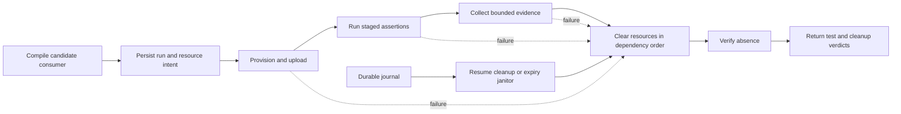

# Integration testing

The integration suite combines generator checks, typed consumers, HTTP fixtures and local
runtime tests. The [suite catalog](../tests/integration/suite.json) lists each case and its
implementation status. Hosted Cloudflare families are still planned; selecting one returns
an incomplete result until its adapter is implemented.

## Available checks

| Component | Local coverage | Hosted coverage to add |
|---|---|---|
| [Library build](SDK-LIBRARY.md) | Selected generation and Release compilation | Deployed behavior of the selected APIs |
| [SDKComposition](../tests/SDKComposition/README.md) | Actual F# consumers compose Workers, Containers and AI provider types | Service responses and deployment lifecycle |
| [ByteBridge](../tests/ByteBridge/README.md) | Generated Workers byte views through Fable and BAREWire under Node | Hosted transport and native endpoint profiles |
| [HawaiiApi](../tests/HawaiiApi/README.md) | Actual generated clients against loopback HTTP fixtures | Cloudflare response behavior and resource lifecycle |
| [ManagementIntegration](../tests/ManagementIntegration/README.md) | Compute, Tunnel, WARP and Access request/response diagnostics, including the inline response regression | Resource provisioning, service behavior, policy enforcement and verified removal |
| [Durable Object tests](durable-objects-testing.md) | Direct F# subclass, storage, alarm retry and local workerd restart | Hosted migration, hibernation, eviction and distributed delivery |
| [Validation Agents runner](../../FSharp.CloudEdge.Validation/scripts/local-agents.mjs) | SDK calls through the retained JS subclass adapter, local state and restart | Hosted Agent lifecycle and external integrations |
| [Validation management CLI](../../FSharp.CloudEdge.Validation/management/Program.fs) | Partial Worker upload/enable/delete and Gateway create/get/delete commands through generated clients | Journal, staged actions, restartable cleanup and absence verification |
| Validation Sandbox and Gateway projects | Project reference scaffolding | Scenario implementations and hosted execution |

The sibling Validation repository supplies optional local runners and prototype management
commands. Check each runner's prerequisites before selecting its case. Hosted lifecycle
adapters, recovery and cleanup remain work for the integration suite.

Management diagnostics check inline `allOf` responses, inherited fields, named result
types and anonymous response unions. These exercise Hawaii's OpenAPI generation path;
Xantham's TypeScript runtime bindings use a separate path.

The maintained Hawaii overlays correct Tunnel-related error contracts
that combined incompatible success and failure envelopes. The correction selects
the existing failure schema under exact source preconditions. The management
suite checks error status, details, nullable result and retry metadata across
the affected API families. Its schema validator requires positive bodies to
have zero errors against the same effective schema used to generate the clients.
Deliberately malformed bodies must produce the expected validation errors.

Additional generator regressions check canonical error-list types and
required-string rejection. The container consumer exercises both scheduling
variants, malformed discriminators and absent identity. These checks use the
schema, generated types and decoder behavior together to identify the layer that
needs correction.

## Ownership

| Contract | Test owner | Example |
|---|---|---|
| Generated symbol, overload, public input and shared type identity | FSharp.CloudEdge | Workers Request remains the owner accepted by Containers |
| Generated management request and response | FSharp.CloudEdge | Container application response decodes from the actual API object |
| Hosted runtime binding behavior | FSharp.CloudEdge | Loader loads a compiled child, Facet abort invalidates its stub and retains its storage |
| Application orchestration | Conclave | Prospero restarts the affected siblings and preserves the job's accepted contributions |
| Resource API security settings | FSharp.CloudEdge | Access policy or Tunnel route creation, reading and removal |
| Application authority | Conclave | Tenant/scope admission, child grants and revocation during an operation |
| Binary view interoperation | FSharp.CloudEdge | Generated body bytes preserve a nonzero-offset payload |
| Application protocol | Conclave | BAREWire job identity and cancellation survive Worker, native and client boundaries |
| Native placement | Conclave | An admitted Clef image executes the required service contract |
| Network overlay behavior | Conclave | An enrolled runner reaches the admitted service through One/WARP and an unauthorized runner is refused |

Facet binding tests use a minimal supervisor. Prospero's strategy, restart budget and
durable join belong to Conclave's scenarios, which compile through Fable and CloudEdge's
Durable Object bindings rather than using Fable's MailboxProcessor implementation.

Common lifecycle infrastructure belongs with CloudEdge's suite. Conclave keeps its
application scenarios and assertions in its own repository.

## Adding hosted tests

The planned hosted runner follows **build, deploy, exercise, clear, verify absence**.
F# consumers compile through .NET and Fable, then bundle with the existing JavaScript tools.
A host-side controller uses generated management clients to provision resources and upload
the emitted module with its bindings and migrations.



The controller records intended resources before each creation request. A creation can succeed while its response is lost or undecodable. Recovery reconciles the exact planned identity before clearing the resource. A broad name prefix is insufficient authority to delete another run's resources.

The journal records a run ID, an account fingerprint and an expiry. Resource records contain exact fixture names and returned IDs. The ordered plan creates prerequisites before dependent resources and cleanup reverses that order. The journal also records candidate artifact hashes and lifecycle progress. Credentials remain outside the journal and evidence bundle.

Use a separately pinned controller build for resource administration and cleanup. The candidate library runs in the test consumer. This permits the suite to report a candidate response-decoding failure while a working controller clears the resource. Record both revisions in the result.

Clearing includes dependent state: pending work, subscriptions and alarms where applicable, then service resources, then the Worker and its owned namespaces or deployment state. Product adapters must implement the correct lifecycle for their resource. DO namespace removal needs the supported class lifecycle mechanism, including removal of the shipped class. A successful Worker delete alone is insufficient evidence of complete cleanup. See [DO class lifecycle](https://developers.cloudflare.com/durable-objects/reference/durable-objects-migrations/).

Every resource adapter supplies bounded polling for readiness and absence. Transient errors use a finite retry policy. Cleanup attempts continue for independent resources after one removal fails. The final result preserves assertion failure and cleanup failure separately.

A killed CI runner cannot execute a finally block. Resume-cleanup and an expiry janitor therefore consume the same ownership journal. Journals must be uploaded to durable CI storage before mutation, or persisted in an equivalent control store. A local journal alone covers process restart on that machine.

The [lifecycle module](../scripts/integration/lifecycle.mjs) supplies adapter-neutral journal
mechanics and fault-path tests. Product-specific Cloudflare adapters, durable CI journal
publication and the expiry janitor remain to be implemented.

## Coverage structure

The [suite catalog](../tests/integration/suite.json) separates implemented local diagnostics
from planned hosted families. Keep each case's implementation status and prerequisites up
to date as adapters become available.

Runtime families cover Workers I/O, DO/Loader/Facets, Workflows, storage bindings,
Agents/chat/MCP, execution tools, Voice, Containers/Sandbox, AI providers, HTTP/RPC,
supporting utilities and Pages plugins. Management families follow the purpose clients
and Tenancy. Conclave families cover application orchestration, authority, native services,
protocols and deployment behavior.

A family contains staged cases. For Containers, those stages include creating an application from a pinned image, awaiting readiness, performing a service request, changing a deployment version and observing recovery, then removing the application and checking absence. The candidate binding must decode the real responses at every step.

Represent each standing feature with its public entry, relevant symbols or operation IDs, consuming case IDs and required execution profile. The authenticated API baseline tracks all selected declarations and operations. Family assignment provides initial ownership. Member-to-case mappings and per-operation behavioral coverage still need to be completed.

Related management operations can share a fixture's resource lifecycle. Record which
operations receive structural checks, authenticated reads or hosted mutations. Account-wide
administrative operations need a suitable test account; report unavailable product
entitlements as coverage gaps.

Conclave's release profile selects the feature contracts required by its admitted deployment manifests. Any additional customer deployment capability adds its contracts to that profile. A passing reduced profile must retain its exact selection in the result.

## Updating SDK dependencies

[Contract tracking](../tests/integration/baselines/README.md) compares the configured SDK
selection with a newly generated candidate. Its baseline includes declaration inputs,
generated F# APIs, management operations and their referenced schemas.

The check records TypeScript inputs as well as generated F# APIs. An upstream change can require review even when a widened F# binding has the same signature. The baseline is never refreshed implicitly.

When upgrading:

1. Regenerate with the candidate's SDK pins and check the input and generator hashes.
2. Review added, changed and removed contracts in the difference report.
3. Compile the affected F# consumers and run their available runtime scenarios.
4. Run hosted fixtures when available, keeping missing adapters visible in the result.
5. Check cleanup and resource absence for any hosted run.
6. Update the reviewed baseline and coverage mappings together.

Changes to shared owners or common HTTP serialization affect more consumers than a single public entry. The suite must expand the affected selection through those dependencies.

## Conclave scenarios

The local Prospero fixture exercises fan-out and durable join with bounded integer
contributions. Select it with `--case conclave.prospero-local`; the catalog records its
sibling-repository prerequisites. Hosted Conclave scenarios remain separate planned cases.

Native tests use the actual compiled Clef artifact and retain its compiler, target profile and image hashes. Current local subprocess evidence and a hosted image lifecycle have separate results. Native protocol coverage must preserve BAREWire representations at both endpoints.

WREN tests distinguish hosted Solid clients from the native host and its authenticated loopback bridge. A browser HTTP driver establishes neither a WREN native launch nor its client security policy.

IoT tests identify the physical device or gateway profile. Hardware fixture prerequisites remain explicit while per-run sessions, credentials and cloud resources are ephemeral. Existing hardware is a test rig, not a resource created by the test.

One/WARP tests require an enrolled runner and a negative-path runner. The fixture owns its routes and policies, revokes its temporary credentials and clears its cloud resources. Run the same application protocol checks over the admitted paths. The overlay's presence establishes neither application authority nor correct native decoding by itself.

Performance cases retain worker count, payload sizes and useful work. They measure latency distributions and throughput alongside coordination traffic and resource use. Barrier-based overlap tests establish outstanding work, while CPU speedup requires separate measured evidence.

## Commands and results

```sh
# Inspect required hosted families without mutation.
npm run test:integration -- --profile cloudflare --list
npm run test:integration -- --profile conclave-cloudflare --list

# Fast checks independent of Wrangler.
npm run test:integration-tooling
npm run test:contracts

# Explicit local diagnostics, including existing optional workerd runners.
npm run test:integration -- --profile local

# Select the direct Miniflare Prospero fixture.
npm run test:integration -- --case conclave.prospero-local
```

The runner defaults to the Cloudflare profile. Hosted families remain incomplete until their adapters exist. A planned, blocked or failed selected case causes a nonzero result. Existing Wrangler-based local probes remain individually selectable diagnostics.

Each run writes JSON, JUnit XML and command logs under a new `artifacts/integration/` directory. Reports retain the selected profile, manifest and runner hashes, timings and prerequisite outcomes. The live adapter must add deployed artifact identity, staged observations, resource receipts and verified absence. CI consumers should expose the assertion verdict and cleanup verdict separately.
